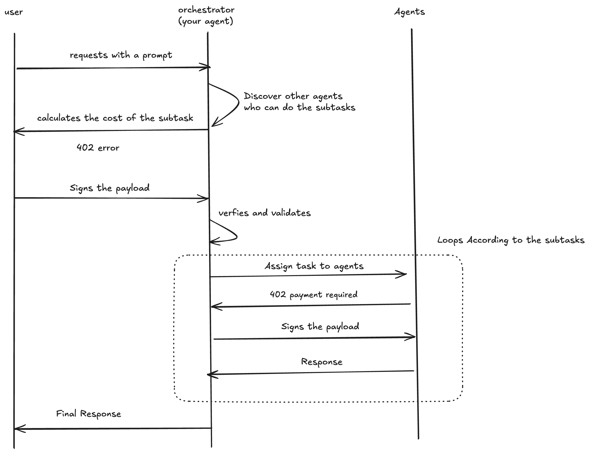

# X402 Aptos Protocol

A comprehensive implementation of the x402 payment protocol for Aptos blockchain, providing SDKs for both server-side facilitators and client-side integration.

## Quick Start - Server SDK

### Installation

```bash
npm install @x402-aptos-facilitator
```

### Basic Express Setup

```typescript
import express from 'express';
import { paymentMiddleware } from '@x402-aptos-facilitator';

const app = express();

// Configure payment routes
const paymentRoutes = {
  '/premium-content': {
    price: '1000000', // 1 APT (in micro-APT)
    network: 'aptos-testnet'
  }
};

// Add payment middleware
app.use(paymentMiddleware(
  '0x123...', // Your Aptos address to receive payments
  paymentRoutes,
  { url: 'https://your-server.com' }
));

// Protected route
app.get('/premium-content', (req, res) => {
  res.json({ 
    message: 'Payment verified!',
    transactionHash: req.transactionHash 
  });
});

app.listen(3000);
```

### Direct Payment Processing

```typescript
import { AptosFacilitator } from '@x402/aptos-facilitator';

const facilitator = new AptosFacilitator({
  aptosNetwork: 'testnet',
  port: 3000,
  mockMode: true // Set to false for production
});

// Process payment
const verification = await facilitator.processPayment(paymentRequest);
if (verification.isValid) {
  console.log('Payment verified!', verification.transactionHash);
}
```

## Protocol Flow

The x402 protocol enables secure payment verification between clients and servers through blockchain transactions:


## How It Works - Step by Step

### 1. Installation
```bash
npm install @x402-aptos-facilitator
```
Installs the facilitator SDK package containing all payment verification tools.

### 2. Route Configuration
```typescript
const paymentRoutes = {
  '/premium-content': {
    price: '1000000', // 1 APT (in micro-APT)
    network: 'aptos-testnet'
  }
};
```
**What this does:**
- Defines which routes require payment and their cost
- `'/premium-content'` - The protected endpoint
- `price: '1000000'` - Costs 1 APT (1,000,000 micro-APT units)
- `network: 'aptos-testnet'` - Uses Aptos testnet for verification

### 3. Payment Middleware Setup
```typescript
app.use(paymentMiddleware(
  '0x123...', // Your Aptos address to receive payments
  paymentRoutes,
  { url: 'https://your-server.com' }
));
```
**What this does:**
- Automatically handles payment verification for all configured routes
- First parameter: Your wallet address where payments are sent
- Second parameter: The route configuration from step 2
- Third parameter: Your server URL (used for generating payment requests)

### 4. Protected Route Handler
```typescript
app.get('/premium-content', (req, res) => {
  res.json({ 
    message: 'Payment verified!',
    transactionHash: req.transactionHash 
  });
});
```
**What this does:**
- Your actual business logic that only runs after payment is verified
- The middleware automatically checks if the user has paid
- If payment is valid, `req.transactionHash` contains the payment transaction
- If not paid, the user gets a 402 Payment Required response

### 5. Payment Flow
1. **Client makes request** to `/premium-content`
2. **Middleware checks** if payment exists for this route
3. **If no payment**: Returns 402 Payment Required with payment instructions
4. **If payment exists**: Verifies the Aptos transaction on blockchain
5. **If valid**: Your route handler runs with `req.transactionHash` available
6. **If invalid**: Returns 402 Payment Required

This creates a seamless pay-per-access system where users must send APT tokens to access your premium content or APIs.

## Use Cases

### 1. Content Monetization (Video Streaming, Blogs, Resources)

Perfect for creators who want to monetize their content directly:

- **Video on Demand**: Users pay APT tokens to stream premium videos
- **Premium Blog Posts**: Access to exclusive articles and tutorials
- **Digital Resources**: Downloads, e-books, software, or any digital asset
- **API Access**: Pay-per-use for premium API endpoints

**Example Setup:**
```typescript
const contentRoutes = {
  '/videos/premium': { price: '500000', network: 'aptos-mainnet' },
  '/articles/exclusive': { price: '100000', network: 'aptos-mainnet' },
  '/downloads/ebook': { price: '200000', network: 'aptos-mainnet' },
  '/api/premium': { price: '50000', network: 'aptos-mainnet' }
};
```

### 2. Agent-to-Agent Protocol

Enable AI agents to communicate and transact autonomously:



- **Service Exchange**: Agents pay each other for specialized services
- **Data Access**: Agents pay for access to premium datasets or APIs
- **Compute Resources**: Payment for processing power or specialized computations
- **Knowledge Sharing**: Agents monetize their expertise and insights

**Example Setup:**
```typescript
const agentRoutes = {
  '/agent/llm-service': { price: '1000000', network: 'aptos-testnet' },
  '/agent/data-access': { price: '500000', network: 'aptos-testnet' },
  '/agent/compute': { price: '750000', network: 'aptos-testnet' }
};
```

This enables a decentralized economy where AI agents can autonomously access services, share resources, and collaborate while maintaining economic incentives for service providers.

